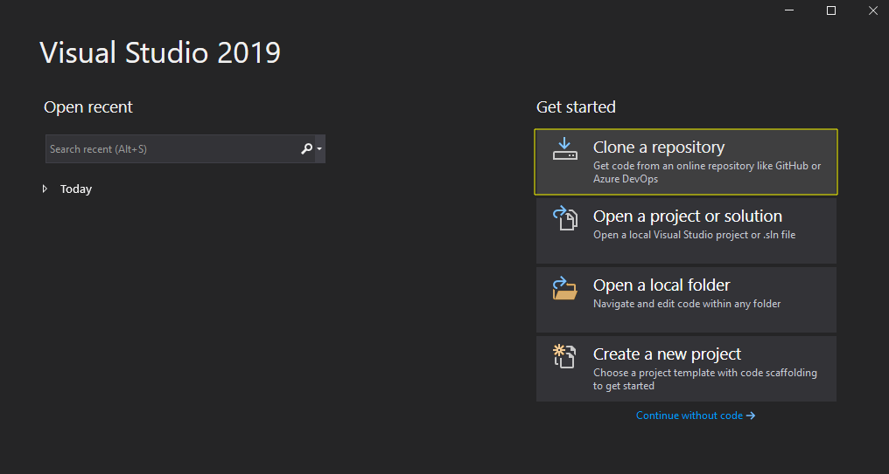
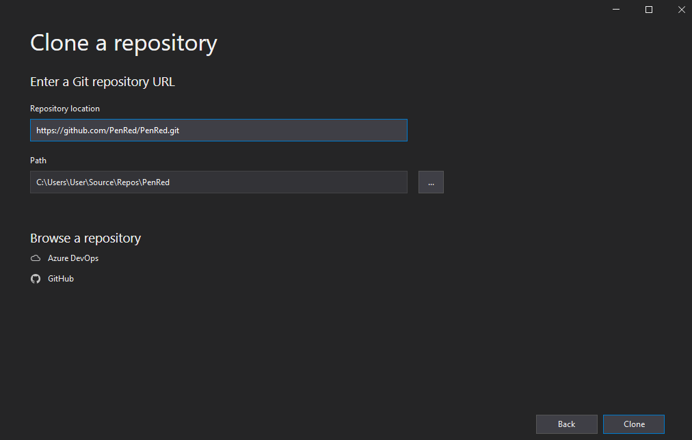
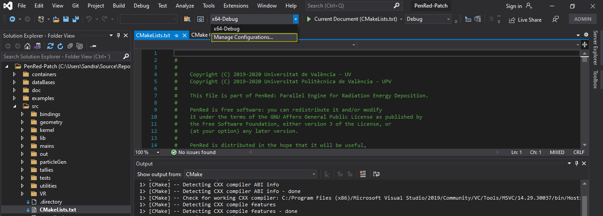
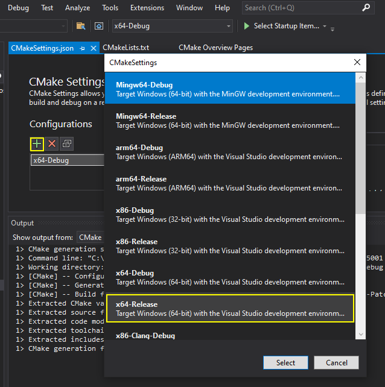
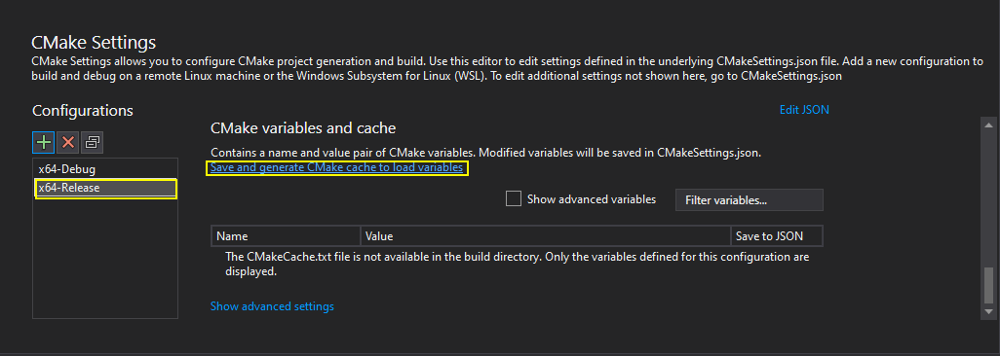
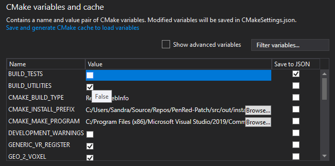
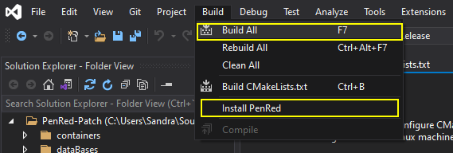
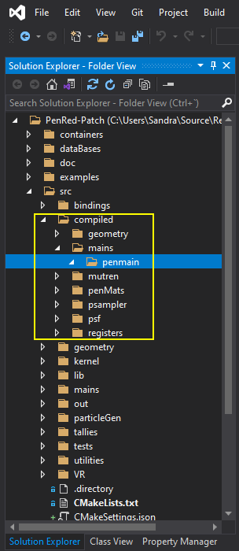

# PenRed
Parallel Engine for Radiation Energy Deposition


## Introduction

PenRed package provides a parallel engine for radiation transport Monte-Carlo simulations. The information about installation, usage and description of source files can be found at the provided documentation. This one is distributed within the PenRed package at

> doc/PenRed_doc.pdf

In addition, users can find a descriptive [academic article](https://arxiv.org/abs/2003.00796) at ArXiv which has been sent to be published.


## Installation

PenRed compilation has been tested in several Linux distributions with gcc 5 to 10 versions, clang and icc. However, the support on windows is not complete tested yet. For example, DICOM geometries have not been tested, but multithreading and MPI capabilities are expected to work. In addition, the compilation on windows has been tested only with the MSVS 2019 compiler.

### Linux code compilation

To install PenRed directly by the code compilation, download PenRed sources from this GitHub repository,

```
git clone https://github.com/PenRed/PenRed.git
```

The code must be compiled in the *src* folder. Thus, move into this folder. To simplify the installation, PenRed includes a CMake file and a bash script (*compile.sh*) to compile the code automatically. In this script, you can enable/disable the following optional features,

1. DICOMs: If it is enabled, PenRed capabilities to read and simulate DICOM images will be active. This option requires the library dicom toolkit (dcmtk).
2. Multi-threading: This option enables multi-threading capabilities. PenRed implements multi-threading via the standard thread library specified in the C++11 standard. Thus, it is not required any extra library to enable this option.
3. MPI: This option enables MPI simulations. It requires a library with an implementation of the MPI standard, such as openmpi or mpich.
4. Load balance: Enables load balancing system between threads and MPI processes. This option requires, as least, multi-threading capabilities, because uses threads to handle MPI communications.

Notice that all previous dependencies are optional. The corresponding libraries can be found at most linux package repositories. For example, to compile PenRed with DICOM support in Fedora, you can use the *dnf* command to install the dependencies,

```
sudo dnf install dcmtk dcmtk-devel
```

After that simple step, you can launch the compilation using the provided script,
```
bash compile.sh
```

or doing it yourself,

```
cd /path/to/PenRed/repository/src
mkdir build
cd build
ccmake ../
make install
```

With *ccmake* you can configure the optional PenRed features with a more friendly interface. But, of course, you can use directly *cmake* defining the appropriate flags like,

```
cmake -DWITH_DICOM="ON" -DWITH_MULTI_THREADING="ON" -DWITH_MPI="OFF" -DWITH_LB="OFF" -DDEVELOPMENT_WARNINGS="OFF" ../
```

### Windows code compilation

To compile the PenRed code using MSVS on windows, first, select "Clone a repository" from the Visual Studio start window.



Then, set the PenRed repository url and push on the clone button.



The download will start automatically. Once the Cmake configuration ends, to avoid compiling with a debug profile, add a new configuration with the configuration manager.



In the configuration panel to the left, click on the button with the green *plus* sign to add a new configuration and select the release depending on your system. In the following image, we selected a release for 64-bit system.



Once you have selected the new configuration, and push on "Save and generate CMake cache to load variables" to be able to change the CMake variables for this configuration and compile it.



Now, we can change all the Cmake configuration variables to enable or disable MPI support and other features.



Finally, build and install PenRed,



If the compilation finishes successfully, a new folder named *compiled* will be created inside the *src* folder containing the PenRed's main program and the executables for all other enabled utilities.



### Usage

Once the code has been compiled, the user can found the executable of our provided main program ready to simulate at,

> src/compiled/mains/pen_main

To execute the program, the user needs a configuration file and, probably, some required data base files, such as material and geometry files. Their path should be specified in the configuration, remaining the configuration file path as the only program argument. So, to execute the program, the user can use the following instruction in a Unix environment,

```
./pen_main path/to/configuration/file
```

or with the inverted slashes (\) if is executed in Windows. On the other hand, if the MPI capabilities have been enabled at the compilation, the code should be executed as any MPI program, for example,

```
mpirun -np Nprocesses ./pen_main path/to/configuration/file
```

where *Nprocesses* specifies the number of MPI processes to use. Of course, the user may use any other options of the *mpirun* command, such as specifying the hosts where the code will be executed via the *hostfile* option.

## Docker containers

As the code grows, several compilation options are included in the *CMakeLists* files. Therefore, providing a prebuilded container for each possible parameter combination is no longer feasible.

Nevertheless, to obtain a containerised version of PenRed, we provide three Dockerfiles in the folder *containers* to generate them. The first one, named *complete* includes all the packages to compile and run PenRed in the Fedora environment. For size optimised versions, we provide also two alpine based Dockerfiles, named *Alpine* and *Alpine-dicom*, which include only the necessary runtime libraries and the PenRed executable for executions without and with DICOM capabilities. However, notice that *Alpine* uses the *musl* library instead of the *glib*, which causes the multithreading PenRed capabilities to don't work properly. 

Notice that each Dockerfile includes a set of predefined compilation options that should be modified by the user according to their needs. For example, if the container will be executed on different architectures, the user should disable the native architecture optimisation specifying the flag

```
-DWITH_NATIVE="OFF"
```

A complete list of all available compilation options can be found in the documentation.
